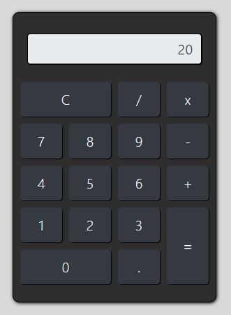

# Calculadora
>Este projeto é uma calculadora desenvolvida com *Javascript*.

Este projeto é uma calculadora desenvolvida com o uso das tecnologias HTML 5, CSS, Bootstrap e Javascript afim de aplicar os conhecimentos aprendidos em aula no curso [Domine Web] da [Udemy].



## Clonando o repositório

Para executar o projeto localmente o repositório deve ser clonado ou baixado com o comando:

```
$ git clone https://github.com/jonathannunesdsouza/calculadora.github.io.git
```
## Histórico de atualização 

* 0.0.1;
    * Lançamento inicial.

## Meta 

Jonathan Douglas Nunes de Souza - [@jonathansouza] - <jonathannunes.souza98@gmail.com>

[@jonathansouza]:https://www.linkedin.com/in/perfil-in/

Distribuido sob licença. Veja **`LICENÇA`** para mais informações.

[https://github.com/jonathannunesdsouza/jonathannunesdsouza.github.io]


[Domine Web]:https://www.udemy.com/course/web-completo/
[Udemy]:https://www.udemy.com/